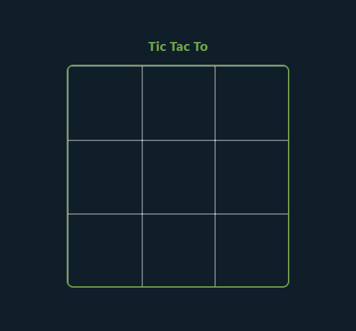
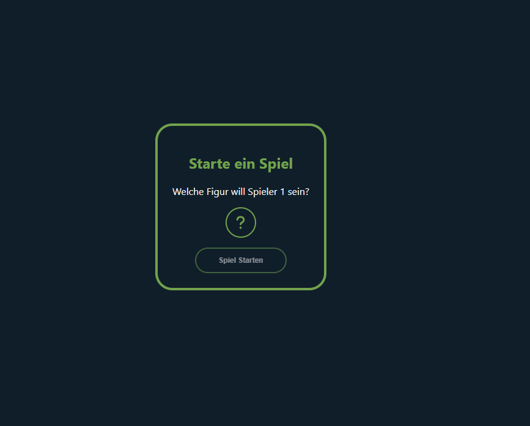
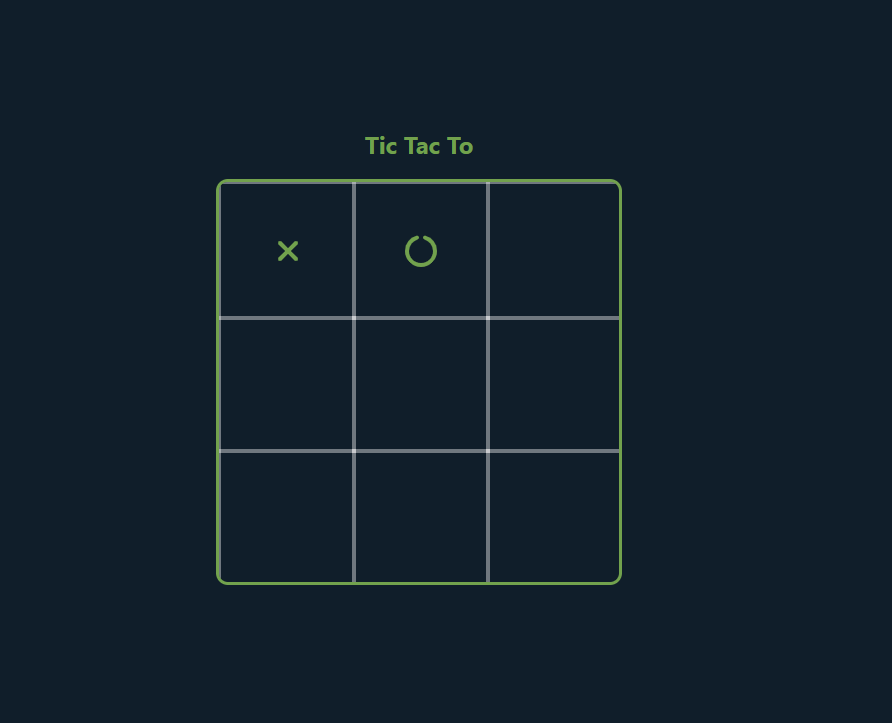
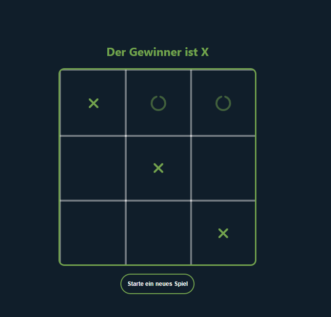

# Tic Tac To



## The game: Tic Tac To

Tic Tac To is a two player game. One player plays as X and the other as O. To win the game, a player needs to get three of their symbols in a row (horizontally), in a column (vertically), or diagonally.

## The aplication

When you start the application, you will see options to choose the symbol for player one. 



After selecting the symbol you can submit to the game.



When a player wins, a message appears above the game, and a button to start a new game appears below.



## So you can clone the project

- First you copy the github download link
```bash
git clone https://github.com/DigitaleWeltLibrary/tic-tac-to.git
```
- Then you have cloned the repository in your directory
- After that you have to install the node packages
```bash
npm install
```
- you are ready to start the game
```bash
npm run dev
```

## Used techniques
- react
- react router-dom
- FontAwesomeIcon

### Have fun with the game

## Versions

### Version 1

The initial release of the Tic-Tac-Toe game, featuring complete game functionality. Players can play against each other, and the game handles turns, win conditions, and draws.

### Version 2

Introduced the ability for users to switch between German and English language within the game interface. The selected language preference is now stored in the browser's local storage, ensuring that the chosen language persists across sessions.